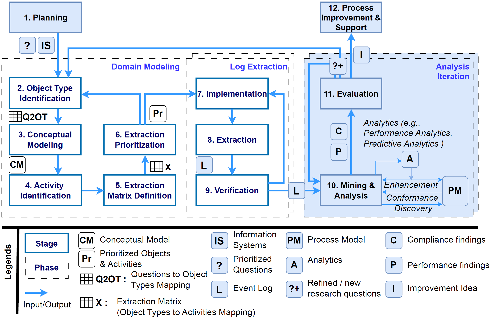
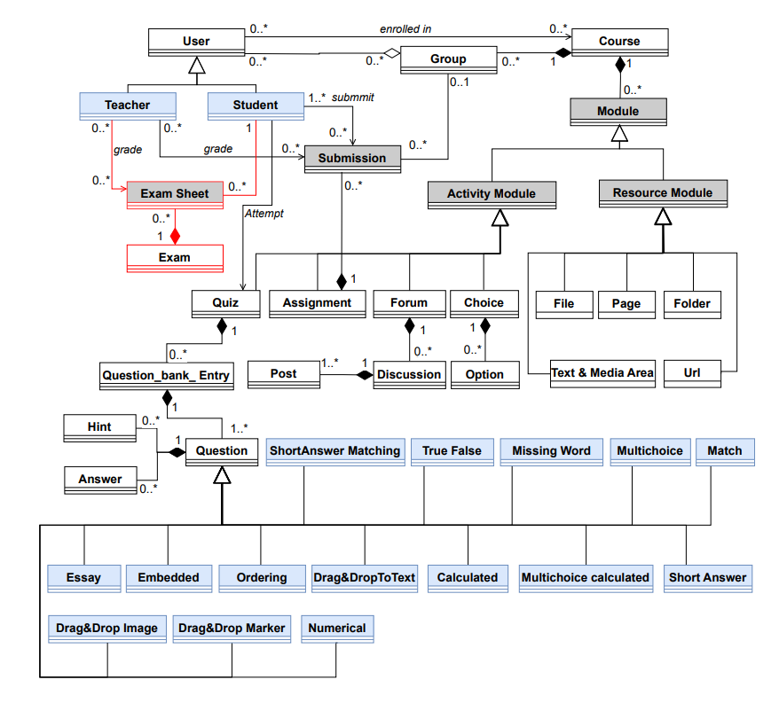

# Methodology and Case Study: Implementing PM4Moodle with our proposed methodology, OCPM2

This document explains, step by step, how the PM4Moodle tool and its underlying case study were implemented using the OCPM2 methodology. It is intended for anyone interested in understanding the methodological framework, design decisions, and the full process behind our educational process mining case study.

---

## Table of Contents

- [Overview of the OCPM2 Methodology](#overview-of-the-ocpm2-methodology)
- [Our Methodological Stages and Case Study Implementation](#our-methodological-stages-and-case-study-implementation)
    - [1. Planning](#1-planning)
    - [2. Domain Modeling](#2-domain-modeling)
    - [3. Log Extraction](#3-log-extraction)
    - [4. Analysis Iteration](#4-analysis-iteration)
    - [5. Process Improvement and Support](#5-process-improvement-and-support)
- [References](#references)

---

## Overview of the OCPM2 Methodology

The OCPM2 methodology, built upon the PM22 process mining methodology, is a structured, system-agnostic approach for extracting and analyzing object-centric event data (OCED) from information systems. 

<!-- Insert methodology overview figure -->

*Figure: Overview of the OCPM2 methodology, extending the PM2 methodology (see also Fig. 2 in the paper, page 10).*

OCPM22 consists of the following phases:
- **Planning**
- **Domain Modeling**
- **Log Extraction**
- **Analysis Iteration**
- **Process Improvement and Support**

Each phase contains specific stages and produces well-defined artifacts, which are illustrated and discussed below.

---

## Our Methodological Stages and Case Study Implementation

This section follows the structure of OCPM2, detailing how each stage was carried out in our educational process mining case study.

---

### 1. Planning

- **Goal:**  
  To identify and prioritize the most relevant business-related questions, ensuring that all subsequent process mining activities are driven by genuine analytical needs in the educational context.

- **What we did:**  
  We conducted structured interviews with ten university instructors to systematically elicit and prioritize business-related questions concerning Moodle-supported teaching and learning. This participatory process established a foundation for the entire case study by capturing the core analytical challenges and interests of key stakeholders.

- **Output Artifacts:**  
  The main artifacts produced in this phase were:
  - A **prioritized list of business-related questions** reflecting the consensus of instructors.
  - Two **identified information systems** (Moodle and an administration grading system) were selected as the focus for addressing the prioritized questions.

- **Prioritized Business-Related Questions and Their Purpose:**

  1. **What learning paths do students typically follow when accessing educational materials, such as files, pages, and folders, throughout a course?**  
  2. **How do students submit (or resubmit) individual and group assignments during the course**  
  3. **Do students who usually take the lead in submitting group assignments on behalf of the group tend to achieve higher final grades?**  
  4. **How is students' exam success related to their frequency of accessing course materials, such as files, pages, and folders?**  
  5. **How can OCEL 2.0 event logs be systematically extracted for Moodle’s most important standard modules?**  

---

### 2. Domain Modeling

- **Goal:**  
  To develop a precise and actionable conceptualization of the case study domain by systematically identifying key object types, event types (activities), and their relationships, providing a rigorous foundation for log extraction and analysis.

- **Stages in This Phase and What We Did:**

  1. **Object Type Identification**

      We identified key object types by systematically mapping educational concepts from the prioritized business-related questions.        This process combined stakeholder interviews, a review of Moodle documentation, and domain analysis.

      - For Questions 1–4, we extracted primary nouns representing core educational entities (e.g., Student, File, Page, Folder,             Assignment, URL, Group, Course, Exam) directly from the analytical questions.
      - For Question 5 (general-purpose event log extraction), we broadened the list using instructor input and module relevance             ratings, adding object types such as Label, Quiz, Forum, and Choice.

      The relationship between each analytical question and the identified object types is summarized in the Question-to-Object Type        (Q2OT) matrix below. Notably, Q5 is associated with all object types except Exam, since exam grading is managed in a separate         platform and not captured by Moodle.

      This matrix ensures that all relevant Moodle modules identified by stakeholders are explicitly included and systematically            supported by event data extraction.

 
      
      src="figures/table3_object_types.png" alt="Table 3: Extracted object types from Moodle modules" width="650"/>

  2. **Conceptual Modeling**

      We developed a conceptual model using UML notation to formalize the relationships among object types identified in the previous       stage. The model distinguishes:

      - **Red-colored classes:** Elements specific to the Exam object type, originating from an external exam administration system.
      - **Black-colored classes:** Object types native to Moodle.
      - **Blue-colored classes:** Specifications of a superclass, differentiated in implementation by a type attribute (e.g.,                different question formats as subtypes of Question).

      This hierarchical structure enables advanced analysis operations such as drill-down, roll-up, fold, and unfold. While UML is          used here for clarity, our methodology is notation-agnostic and supports equivalent modeling approaches.

      The model was iteratively refined by:
      - Including object types missed by initial Q2OT mapping, such as Teacher (identified via deeper documentation review) and User         (as a generalization of Teacher and Student).
      - Utilizing a source discovery tool ([Moodle_Database_Comparison](https://github.com/MiriNajme/Moodle_Database_Comparison)) to         detect additional object types (e.g., Forum, Discussion, Post) by comparing database changes before and after operations.

      Design decisions (e.g., treating Grades as an attribute of Submission, modeling Exam Sheet as part of Exam) reflect the desire        to balance simplicity and analytical power. Exam-related classes are included for completeness in cross-system analysis, even         though they are not native to Moodle.

      

 3. **Activity (Event Type) Identification**

  To identify relevant activities (event types) for each business-related question, we:

  1. Analyzed the main verbs and tasks in each question to determine core actions of interest (e.g., viewing materials, submitting assignments, grading).
  2. Used Moodle’s official documentation and our source discovery tool to systematically identify and supplement activity lists, especially for general-purpose extraction (e.g., Question 5).
  3. Developed UML statechart diagrams for selected modules (such as File) to map all theoretically possible and observable activities.

  For example, for the File module, possible activities include creating, importing, viewing, updating, hiding, showing, making available/unavailable, and deleting files. Each is represented as a potential state transition in the module’s lifecycle.

  - **Comprehensive Statechart:**  
  The initial UML statechart models the full lifecycle of the File module, including all theoretically possible transitions (e.g., changing visibility or availability, hierarchical nesting by parent section).
  

  - **Log-Feasible Statechart:**  
  Due to Moodle’s logging limitations, many transitions (such as hide, show, make available, or unavailable) are logged only as generic updates and cannot be traced in detail. We created a filtered version of the statechart showing only transitions supported by actual event logs—such as create/import, update, view, and delete. This filtered model exposes the gap between possible and observable activities due to logging granularity.
  

  These diagrams were designed for all included modules, ensuring that both theoretical and log-feasible activities were systematically identified and documented.

4. **Extraction Matrix Definition**

The extraction matrices provide a structured overview of how each identified activity is associated with relevant object types for the Resource and Activity modules. These matrices document the possible relationships and cardinalities, clarifying which object types participate in which activities.

Key highlights:
- The matrices include both Moodle-native object types and those integrated from external systems (e.g., Exam and the "set exam grade" activity for comprehensive analysis of Questions 3 and 4).
- The object type **User** is added as a generalization of Teacher and Student, capturing shared interactions across both roles.
- Matrix cells indicate the possible cardinality for each object–activity relationship, supporting a systematic and reproducible log extraction process.

> *Due to their size and detail, the complete extraction matrices are provided in Tables 3 and 4 of the paper.*

 
## References

For in-depth details, figures, and further explanations, see the full paper:  
*Miri, N., Khayatbashi, S., Zdravkovic, J., Jalali, A.: "OCPM2: An Object-Centric Process Mining Methodology" (2025).*

---

