#  OCPM2: Methodology and Case Study

This document explains, step by step, how the PM4Moodle tool and its underlying case study were implemented using the OCPM2 methodology. It is intended for anyone interested in understanding the methodological framework, design decisions, and the full process behind our educational process mining case study.

---

## Table of Contents

- [1. Planning](#1-planning)
- [2. Domain Modeling](#2-domain-modeling)
    - [2.1 Object Type Identification](#21-object-type-identification)
    - [2.2 Conceptual Modeling](#22-conceptual-modeling)
    - [2.3 Activity (Event Type) Identification](#23-activity-event-type-identification)
    - [2.4 Extraction Matrix Definition](#24-extraction-matrix-definition)
    - [2.5 Extraction Prioritization](#25-extraction-prioritization)
- [3. Log Extraction](#3-log-extraction)
    - [3.1 Implementation](#31-implementation)
    - [3.2 Extraction](#32-extraction)
    - [3.3 Verification](#33-verification)
- [4. Analysis Iteration](#4-analysis-iteration)
    - [4.1 Answering Question 1: Learning Paths](#33-verification)
    - [3.3 Verification](#33-verification)
    - [3.3 Verification](#33-verification)     
- [5. Process Improvement & Support](#5-process-improvement-and-support)
- [References](#references)

---

## 1. Planning

- **Goal:**  
  To identify and prioritize the most relevant business-related questions, ensuring that all subsequent process mining activities are driven by genuine analytical needs in the educational context.

- **What we did:**  
  We conducted structured interviews with ten university instructors to systematically elicit and prioritize business-related questions concerning Moodle-supported teaching and learning. This participatory process established a foundation for the entire case study by capturing the core analytical challenges and interests of key stakeholders.

- **Output Artifacts:**  
    - A **prioritized list of business-related questions** reflecting the consensus of instructors.
    - Two **identified information systems** (Moodle and an administration grading system) were selected as the focus for addressing the prioritized questions.

- **Prioritized Business-Related Questions and Their Purpose:**

1. What learning paths do students typically follow when accessing educational materials, such as files, pages, and folders, throughout a course? 
2. How do students submit (or resubmit) individual and group assignments during the course?  
3. Do students who usually take the lead in submitting group assignments on behalf of the group tend to achieve higher final grades? 
4. How is students' exam success related to their frequency of accessing course materials, such as files, pages, and folders?
5. How can OCEL 2.0 event logs be systematically extracted for Moodle’s most important standard modules?  

---

## 2. Domain Modeling

- **Goal:**  
  To develop a precise and actionable conceptualization of the case study domain by systematically identifying key object types, event types (activities), and their relationships, providing a rigorous foundation for log extraction and analysis.

### 2.1 Object Type Identification

We identified key object types by systematically mapping educational concepts from the prioritized business-related questions. This process combined stakeholder interviews, a review of Moodle documentation, and domain analysis.

- For Questions 1–4, we extracted primary nouns representing core educational entities (e.g., Student, File, Page, Folder, Assignment, URL, Group, Course, Exam) directly from the analytical questions.
- For Question 5 (general-purpose event log extraction), we broadened the list using instructor input and module relevance ratings, adding object types such as Label, Quiz, Forum, and Choice.

The relationship between each analytical question and the identified object types is summarized in the Question-to-Object Type (Q2OT) matrix below. Notably, Q5 is associated with all object types except Exam, since exam grading is managed in a separate platform and not captured by Moodle.

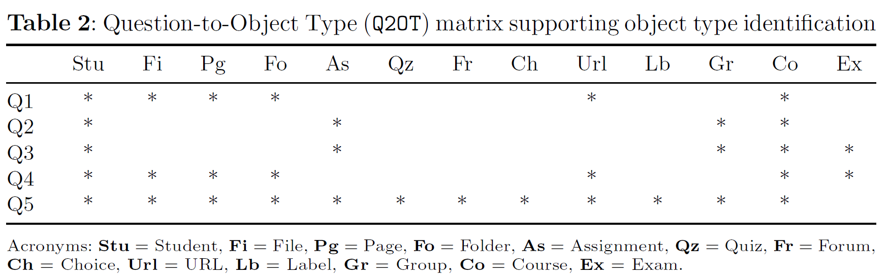

This matrix ensures that all relevant Moodle modules identified by stakeholders are explicitly included and systematically supported by event data extraction.

### 2.2 Conceptual Modeling

We developed a conceptual model using UML notation to formalize the relationships among object types identified in the previous stage. The model distinguishes:

- **Red-colored classes:** Elements specific to the Exam object type, originating from an external exam administration system.
- **Black-colored classes:** Object types native to Moodle.
- **Blue-colored classes:** Specifications of a superclass, differentiated in implementation by a type attribute (e.g., different question formats as subtypes of Question).

This hierarchical structure enables advanced analysis operations such as drill-down, roll-up, fold, and unfold. While UML is used here for clarity, our methodology is notation-agnostic and supports equivalent modeling approaches.

The model was iteratively refined by:
- Including object types missed by initial Q2OT mapping, such as Teacher (identified via deeper documentation review) and User (as a generalization of Teacher and Student).
- Utilizing a source discovery tool ([Moodle_Database_Comparison](https://github.com/MiriNajme/Moodle_Database_Comparison)) to detect additional object types (e.g., Forum, Discussion, Post) by comparing database changes before and after operations.

Design decisions (e.g., treating Grades as an attribute of Submission, modeling Exam Sheet as part of Exam) reflect the desire to balance simplicity and analytical power. Exam-related classes are included for completeness in cross-system analysis, even though they are not native to Moodle.

### 2.3 Activity (Event Type) Identification

To identify relevant activities (event types) for each business-related question, we:

- Analyzed the main verbs and tasks in each question to determine core actions of interest (e.g., viewing materials, submitting assignments, grading).
- Used Moodle’s official documentation and our source discovery tool to systematically identify and supplement activity lists, especially for general-purpose extraction (e.g., Question 5).
- Developed UML statechart diagrams for selected modules (such as File) to map all theoretically possible and observable activities.

For example, for the File module, possible activities include creating, importing, viewing, updating, hiding, showing, making available/unavailable, and deleting files. Each is represented as a potential state transition in the module’s lifecycle.

- **Comprehensive Statechart:**  
  The initial UML statechart models the full lifecycle of the File module, including all theoretically possible transitions (e.g., changing visibility or availability, hierarchical nesting by parent section).
  

  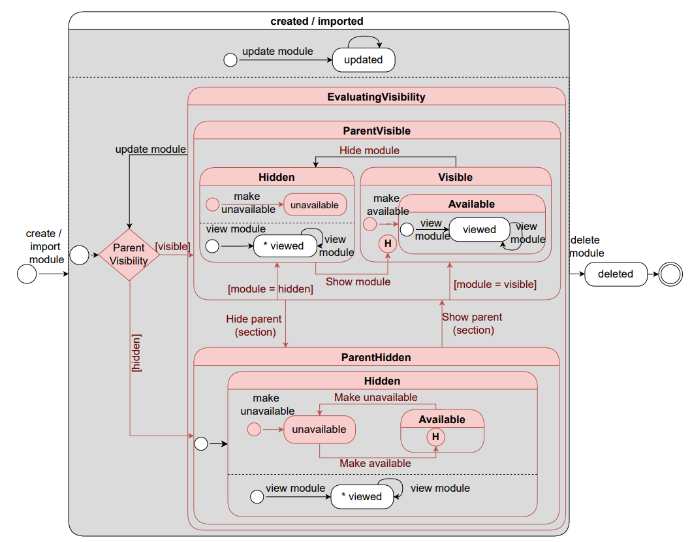
  

- **Log-Feasible Statechart:**  
  Due to Moodle’s logging limitations, many transitions (such as hide, show, make available, or unavailable) are logged only as generic updates and cannot be traced in detail. We created a filtered version of the statechart showing only transitions supported by actual event logs, such as create/import, update, view, and delete. This filtered model exposes the gap between possible and observable activities due to logging granularity.

 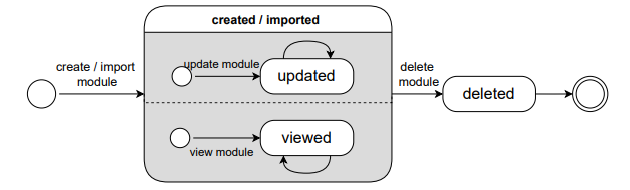
 

These diagrams were designed for all included modules, ensuring that both theoretical and log-feasible activities were systematically identified and documented.

### 2.4 Extraction Matrix Definition

The extraction matrices provide a structured overview of how each identified activity is associated with relevant object types for the Resource and Activity modules. These matrices document the possible relationships and cardinalities, clarifying which object types participate in which activities.

**Key highlights:**
- The matrices include both Moodle-native object types and those integrated from external systems (e.g., Exam and the "set exam grade" activity for comprehensive analysis of Questions 3 and 4).
- The object type **User** is added as a generalization of Teacher and Student, capturing shared interactions across both roles.
- Matrix cells indicate the possible cardinality for each object–activity relationship, supporting a systematic and reproducible log extraction process.

- [Extraction Matrix for Resource Modules (Table 3, PNG)](figures/table-resources-extraction-matrix.png)
- [Extraction Matrix for Activity Modules (Table 4, PNG)](figures/table-activities-extraction-matrix.png)

*Tip: Right-click and choose “Open link in new tab” to view matrices without leaving this page.*

### 2.5 Extraction Prioritization

Extraction efforts were systematically prioritized based on the analytical needs identified in the research questions and instructor feedback:

- **Assignment** was prioritized as the most critical module, given its central role in formative assessment prior to final exams.
- **File** was next, due to its widespread use for sharing educational materials that directly support learning.

The initial extraction sequence focused on key activities and interactions:  
*submit assignment, resubmit assignment, set assignment grade, view file, view URL, view folder, view page,* and *set exam grade*.

For general-purpose extraction (Question 5), module importance ratings provided by instructors guided the prioritization. The order was:  
**Assignment, Forum, File, Quiz, URL, Folder, Page, Choice,** and **Label**.

Where event logs had already been extracted for specific activities in earlier phases, efforts shifted to additional modules to ensure all relevant event and object types in the extraction matrix were ultimately covered.

---

## 3. Log Extraction

Regarding the log extraction phase, the enterprise log extraction setup (see figure below) illustrates how teams collaboratively design, implement, and operationalize the OCEL extraction process in practice. By organizing activities into distinct roles and well-defined steps—spanning domain modeling, test case creation, pipeline implementation, and automated deployment—this setup ensures repeatable, robust, and auditable extraction of event logs across development, test, and production environments. The process also incorporates source discovery and continuous refinement, enabling organizations to handle both known and newly uncovered activities and data sources.

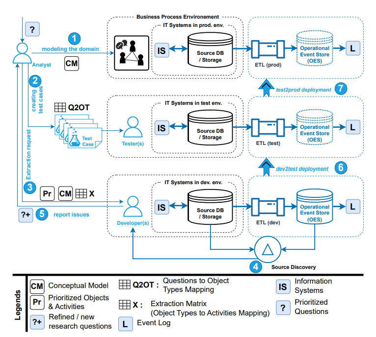

### 3.1 Implementation

We developed and released **PM4Moodle**, an open-source tool for repeatable OCEL 2.0 log extraction from Moodle.  

**Architecture:**
- **Frontend:** Built in TypeScript and React, providing an interactive, user-friendly interface for configuring and initiating log extraction.
- **Backend:** Developed in Python using Flask, integrating the PM4Py process mining library for robust log processing and analysis.

**Usage highlights:**
- Users connect to any Moodle database by entering credentials via the interface.
- Extraction can be targeted: users may select specific courses, module types (e.g., assignment, file, folder, URL), and event types of interest.
- For convenience, PM4Moodle also supports “one-click” extraction—automatically generating OCEL 2.0 logs for all courses and supported modules.

For step-by-step usage instructions, see the [User Guide](USER_GUIDE.md).

### 3.2 Extraction

We used **PM4Moodle** to extract OCEL 2.0 logs from both test and production Moodle environments.

- **Test Environment:**  
  Data extraction began with a test setup using two simulated courses, with systematically entered data to cover all relevant event and object types. The inclusion of a second course enabled us to capture import events between courses and verify that the tool could extract comprehensive OCEL 2.0 logs for all modules relevant to general-purpose extraction (Q5), even those not always present in real-world settings.

- **Production Environment:**  
  After successful testing, we extracted data from a real course spanning one academic year. This production dataset enabled us to address the first four analytical questions and to validate the method in a real-world context, capturing detailed records of student and teacher interactions—including assignments, submissions, grading, and resource usage—across the course lifecycle.

**Outputs:**
- The tool generates OCEL 2.0 event logs in JSON format, adhering to the latest object-centric event log standards.
- For each extraction, PM4Moodle automatically produces Object-Centric Directly-Follows Graphs (OC-DFGs).
- Both the OCEL log and OC-DFG visualizations are directly downloadable through the interface.

### 3.3 Verification

**PM4Moodle** enables systematic verification of the extracted OCEL logs from both test and production environments using two approaches: **Verification Matrices** (frequency and cardinality) and **State Chart Diagrams**, each accessible as dedicated tabs in the interface.

#### Verification Matrices

- **Frequency Matrix:** Shows the number of each object type associated with every event type, helping to confirm the expected relationships in the log.
- **Cardinality Matrix:** Presents the minimum and maximum numbers of each object type per event type, supporting detailed cardinality checks.
- Both matrices can be filtered by object and event type for focused analysis.
- Users can compare the generated verification matrices against the extraction matrix to check completeness and correctness.

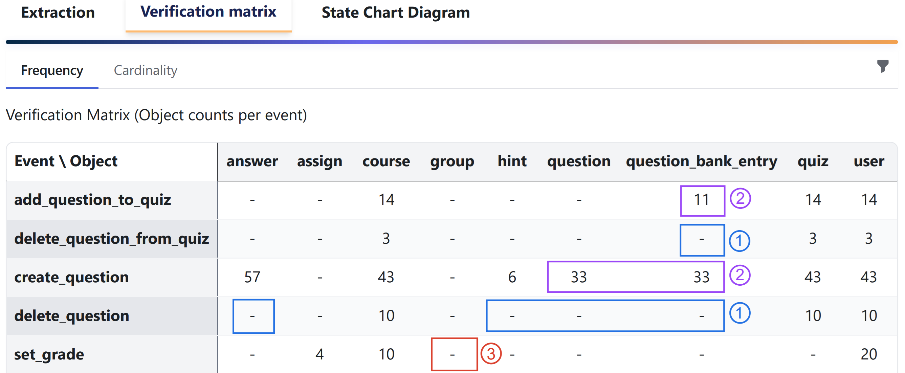
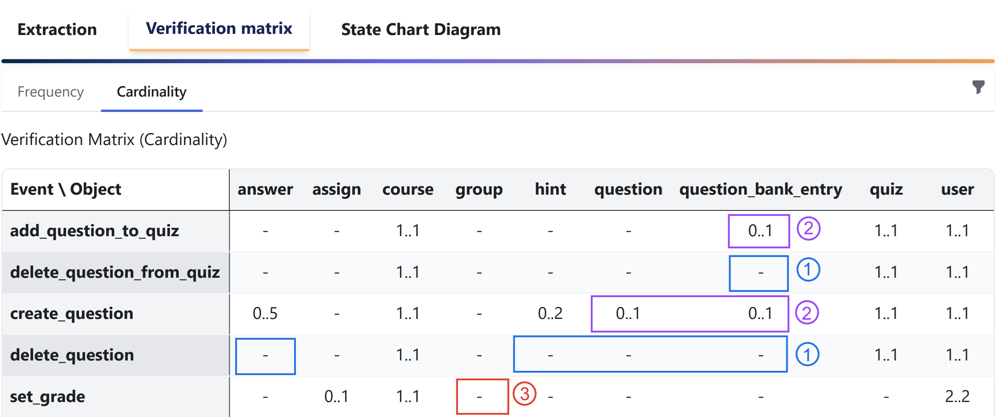

**Insights and Case Study Findings:**  
While most expected relationships and cardinalities were correctly extracted, we identified three notable issues in our case study:

1. **Missing Associations Due to Deletion Logic:**  
   - For `delete question` event, expected links to Question, Answer, Hint, and Question Bank Entry, and for `delete question from quiz` event expected link to Question Bank Entry were absent.   
   - *Reason:* When an object is deleted, Moodle simultaneously removes all related objects, so these associations are not recorded in the log.

2. **Discrepancies in Creation and Addition Events:**  
   - For `create question` and `add question to quiz` events, observed cardinality was 0..1 (not 1..1) for Question Bank Entry and Question.  
   - *Reason:* When these objects are deleted after their creation, some events of these types in the log are without any relationship to the now-deleted objects. This results in observed events that lack the expected associations.

3. **Missing Group-Grading Relationships:**  
   - The `set grade` event lacked the expected link to Group for group assignments (expected cardinality 0..1).  
   - *Reason:* Moodle logs a `set grade` event for each student, not directly for groups, even when group grading occurs.

These issues are highlighted in the verification matrices above. They stem from Moodle’s internal event logging and deletion behavior, not from limitations in the extraction process itself. Recognizing these patterns is essential for the correct interpretation and analysis of educational process data.

#### State Chart Diagrams

- PM4Moodle automatically generates state chart diagrams for each module based on the extracted event log (see example below for the File module).
- These diagrams allow analysts to directly compare the actual process behavior captured in the OCEL with the expected lifecycle defined in hand-crafted models.
- For the File module, the generated state chart was found to be **identical to the hand-crafted diagram** in terms of all relevant state transitions: after creation or import, a file can be viewed or updated any number of times, and deletion is possible from all other states, terminating further activity.
- While the automatically generated diagrams do not display state hierarchy, they provide a faithful representation of the key behavioral transitions, demonstrating the tool's reliability for lifecycle analysis.

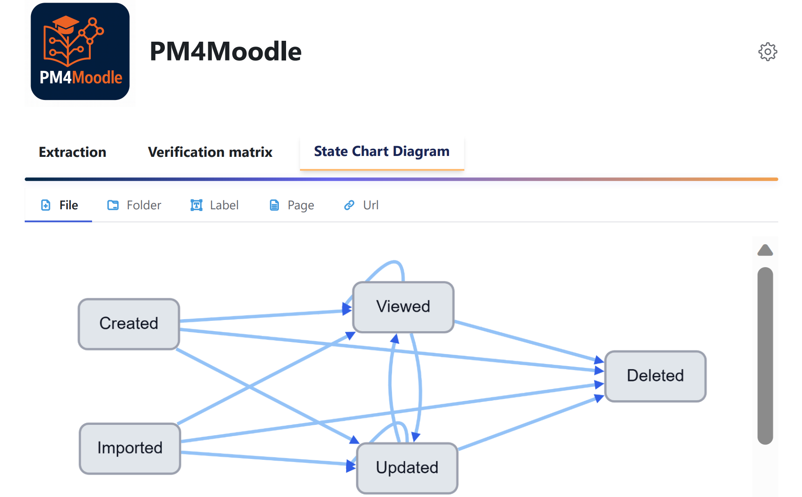

---

## 4. Analysis Iteration

We analyzed the extracted OCEL logs from the real-world case study to answer each prioritized business-related question. Results were reviewed by the course responsible to ensure accuracy. Each analysis iteration began with a **log adjustment** to tailor the data to the research question.

### 4.1 Answering Question 1: Learning Paths

- **Goal:** Explore how students visit and interact with course pages.
- **Approach:**  
  - Compared the discovered Object-Centric Directly-Follows Graph (OC-DFG) before and after log adjustment (see figures below).
  - Log adjustment involved drilling down page objects, unfolding view events by page name, and separating user roles.
- **Findings:**  
  - Without log adjustment, the process model did not provide insights into specific page visits(see the figure below).
  

  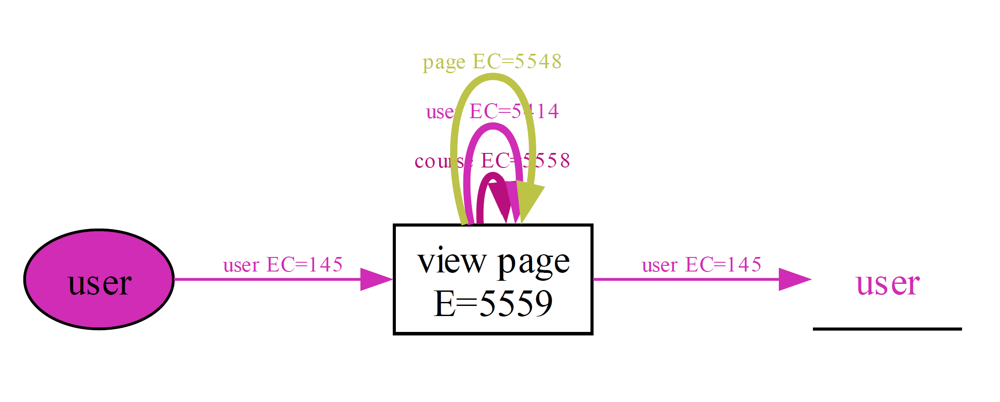
  

  - After adjustment, the OC-DFG visualized students’ sequential access of pages, revealing revisit loops and suggesting areas for curriculum improvement(see the figures below).
  

  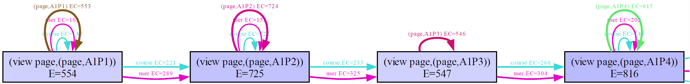
  

  

  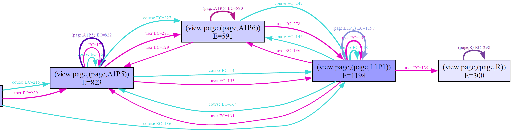
  

### 4.2 Answering Question 2: Assignment Submission Behaviors

- **Goal:** Understand patterns in individual and group assignment submissions.
- **Approach:**  
  - Applied log adjustment to filter for submission activities, drill down user and assignment objects, and unfold relevant events.
- **Findings:**  
  - OC-DFG revealed sequential flows in assignment submissions.
  - The analysis showed both group and individual interactions and highlighted issues such as discrepancies between submission and grading relationships due to Moodle’s logging structure.

    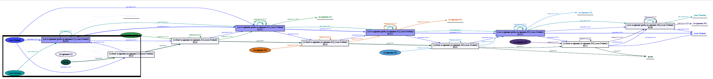

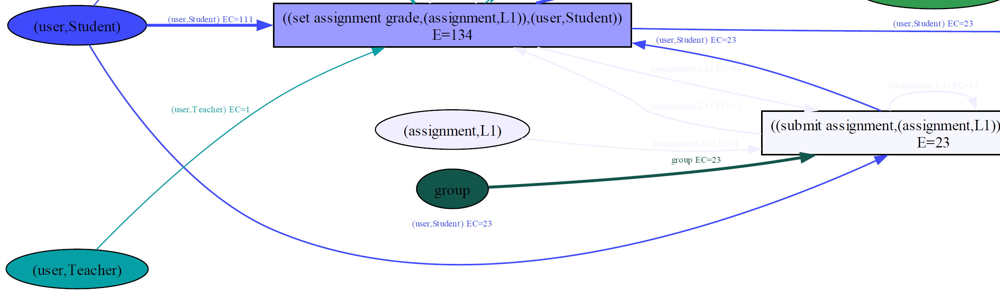

### 4.3 Answering Question 3: Leadership in Group Assignments

- **Goal:** Determine if lead submitters in group work achieve higher grades.
- **Approach:**  
  - Identified “lead” students by submission frequency.
  - Mapped final grades from A–F to 5–0.
  - Compared grade distributions between lead and non-lead submitters using histograms and box plots.
- **Findings:**  
  - Lead submitters had significantly higher grades (p = 0.0334, Mann–Whitney U test).
  - Boxplot confirmed a higher median and narrower grade range for lead students.
  - Indicates a link between leadership in submissions and academic performance.

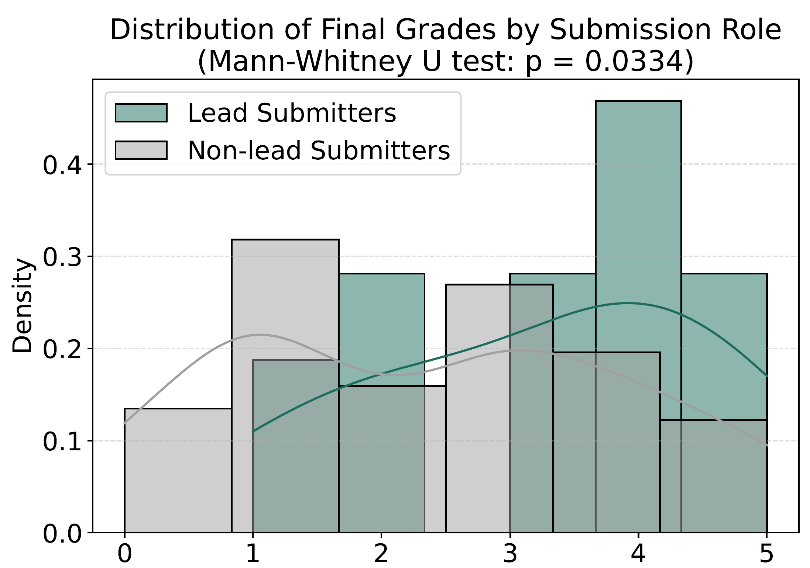
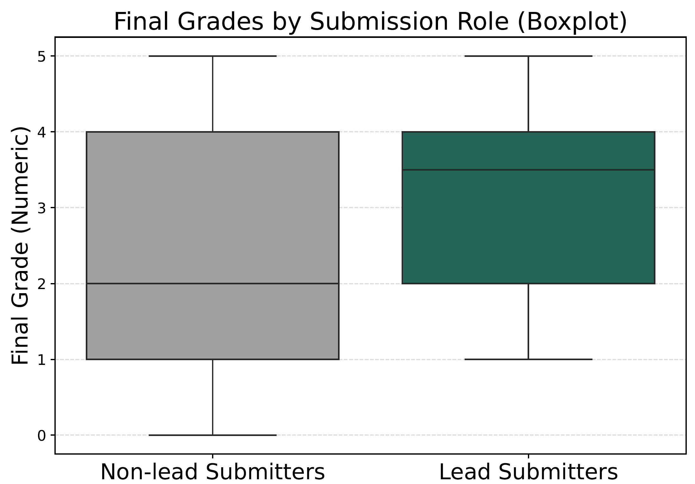

### 4.4 Answering Question 4: Resource Access and Exam Performance

- **Goal:** Assess the relationship between resource access and exam grades.
- **Approach:**  
  - Performed log adjustment, calculated frequencies of folder, page, and file views.
  - Used Pearson correlation and multiple regression.
- **Findings:**  
  - No statistically significant relationship was found (all r ≈ 0.12, p > 0.20).
  - Regression explained just 2.2% of grade variance.
  - Indicates that the simple frequency of content access does not predict exam performance.

For each question, iterative log adjustment and tailored analysis ensured that the extracted event logs provided actionable insights aligned with stakeholder needs and the OCPM2 methodology.

---

## 5. Process Improvement & Support

Based on our analysis of the real-world data:

- **Curriculum Refinement:**  
  Students frequently revisited course pages related to control-flow perspectives, process complexity, and process trees, suggesting potential challenges in topic comprehension or course sequencing.  
  **Recommendation:** Adjust the course structure by moving process tree discussions after control-flow perspectives and introducing process complexity at the end. This may help reduce unnecessary navigation and create a more structured learning experience. Further investigation is encouraged to fully understand and address the reasons behind these patterns.

- **Collaborative Learning Enhancement:**  
  Students who consistently led group assignment submissions achieved higher final grades, highlighting the benefits of active leadership in collaborative tasks.  
  **Recommendation:** Encourage instructors to rotate leadership roles within groups so that each student leads at least one assignment. This approach may improve accountability, engagement, and help prevent passive participation in group work.

These insights, supported by the OCPM2 methodology, demonstrate the tool’s ability not only to analyze but also to inform actionable educational improvements.

---

## References

For in-depth details, figures, and further explanations, see the full paper:  
*Miri, N., Khayatbashi, S., Zdravkovic, J., Jalali, A.: "OCPM2: An Object-Centric Process Mining Methodology" (2025).*

---
