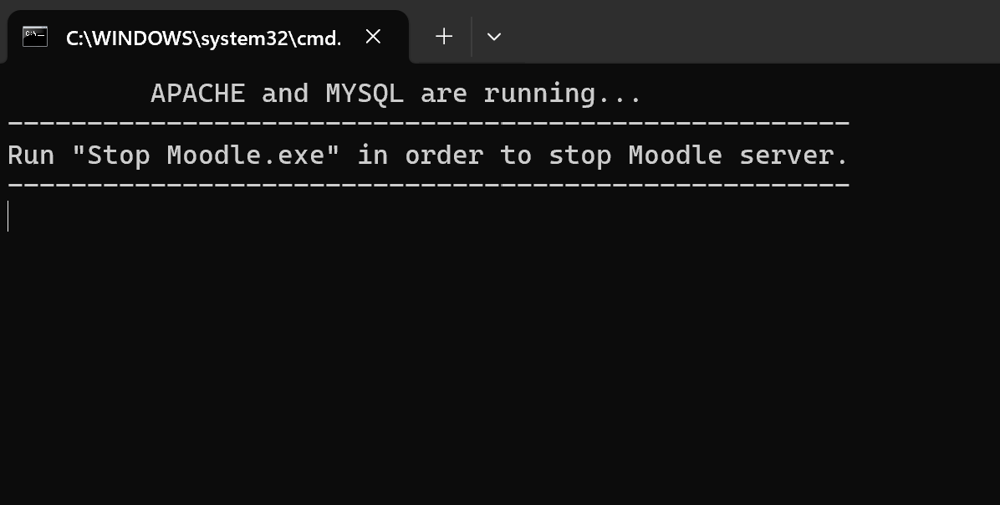

# Moodle Setup Guide

This guide explains how to download and install Moodle on your local computer (Windows or Mac) and connect it to a database app such as HeidiSQL.

---

## 1. Download Moodle

Download the recommended Moodle version (5.1) for your operating system:

- **For Mac:** [https://download.moodle.org/macosx/](https://download.moodle.org/macosx/)
- **For Windows:** [https://download.moodle.org/windows/](https://download.moodle.org/windows/)

> **Note:**  
> The test dataset provided with this project was created using **Moodle version 5.1**. We recommend using this version for maximum compatibility.

---

## 2. Install and Start Moodle

**Windows or Mac:**

- Unzip the folder you downloaded.
- Run the `Start Moodle` executable from inside the unzipped folder.
- Wait until you see the Command Prompt window appear as shown below.
- If your firewall asks for permission to allow Apache or MySQL/MariaDB (mysqld), choose **Allow**.

  

---

## 3. Complete Moodle Initial Setup

Once started, open your web browser and go to:

- [http://localhost/](http://localhost/) (default)
- or, if it does not work, try [http://localhost:8080/](http://localhost:8080/)

Follow these steps to complete the initial Moodle setup:

1. **Choose Language**
   - The installer shows the “Choose a language” page.
   - The default is English; you may change it if desired.
   - Click **Next**.

2. **Confirm Paths**
   - The “Confirm paths” page shows your web address, Moodle directory, and data directory.
   - By default, these point to your unzipped Moodle folder - usually, you can leave them as is.
   - Click **Next**.

3. **Database Settings**
   - Enter your database connection details:
     - **Database host:** by default `localhost`
     - **Database name** by default `moodle`
     - **Database User** by default `root`
     - **Table prefix:** *You must leave this as the default value (`mdl_`)*.
     - **Choose a password if you wish**
   - Click **Next**.

   

     
   

4. **Redirect**
   - You may see a page (see figure below); wait until it automatically redirects to the “Installation” page.

   

     
   

5. **Installation Page**
   - The “Installation” page displays Moodle’s copyright.
   - Click **Continue**.

5. **Server Checks**
   - This page shows some server checks.
   - Click **Continue**.

6. **Moodle Database Installation**
   - The installer will automatically create database tables and initialize Moodle.
   - This may take from a few seconds to about a minute.
   - When it’s done, click **Continue**.

7. **Create Administrator Account**
   - Fill out the administrator account form.
     - **Password, First name, Last name, Email address** are *required* fields.
   - Click **Update profile**.
  

     
  

  
9. **Site Home Settings**
    - On this page, just the following fields are required:
     - **Full site name** (e.g., “My Moodle Test Site”)
     - **Short name** (e.g., “moodle”)
   - Provide **support email** if prompted.
   - Click **Save changes**.

10. **Moodle is Ready**
    - You should now see the Moodle main page (the dashboard).

You can now log in with your administrator account and start using Moodle!

---

## 4. Download and Install HeidiSQL

1. **Download the Installer**
   - Go to [the official HeidiSQL download page](https://www.heidisql.com/download.php?download=installer&place=LinkLabelRelease).
   - Download the `.exe` installer file.

2. **Run the Installer**
   - Double-click the downloaded file to launch the installer.
   - Click through the standard Windows installation prompts (accept the license agreement, choose installation directory, etc.).

*HeidiSQL does not require administrator rights for normal use, but you may need them for installation on some systems.*

## 5. Connect Moodle to Your Database

 Open HeidiSQL from your start menu or desktop

- **Database type:** MySQL or MariaDB
- **Database host:** `localhost`
- **Database name:** (e.g., `moodle`)
- **Database user:** (e.g., `root`)
- **Database password:** (your chosen password, if you chose any while setting up Moodle)

     

---

You’re all set! Moodle is installed and running, and you can inspect or manage your database with HeidiSQL as needed.
