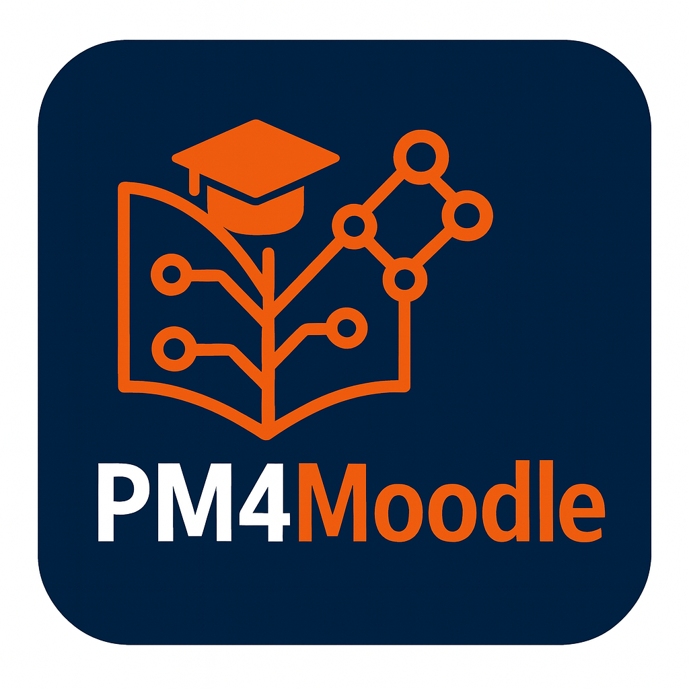

# PM4Moodle



**PM4Moodle** is a specialized, open-source tool for extracting [OCEL 2.0](https://www.ocel-standard.org/) event logs from Moodle, focused on the most common and important Moodle modules. It offers a modern, intuitive interface for users to connect directly to their Moodle database and extract OCEL 2.0 logs effortlessly, enabling advanced process mining and learning analytics.

---

## Key Features

- **Database Connection Interface:** Easily connect to your Moodle database through a user-friendly settings dialog.
- **OCEL 2.0 Extraction:** Seamlessly extract OCEL 2.0 event logs from supported Moodle modules for targeted or comprehensive analysis.
- **Object-Centric Directly-Follows Graph (OC-DFG):** Automatically generate OC-DFG visualizations from the extracted logs to capture behavioral flows.
- **Verification Matrices:** 
  - **Object Frequency Matrix:** Visualize the frequency of each object type per event, supporting quick log quality checks.
  - **Cardinality Matrix:** Display the captured cardinality of objects per event as found in the extracted log, offering deeper insight into object-event relationships.
  - **Flexible Filtering:** Both matrices can be filtered dynamically by columns (event types) and rows (object types), allowing users to focus on specific aspects of the log for verification and analysis.
- **Lifecycle Diagrams:** For each supported module, generate state charts (lifecycle) diagrams based on actual event occurrences, giving a clear view of lifecycle transitions in the extracted data.
- **Downloadable Outputs:** Download both the OCEL 2.0 JSON log and generated OC-DFGs directly from the interface.

This tool streamlines the extraction, validation, and analysis of object-centric event logs from Moodle, facilitating educational analytics using object-centric process mining.

---
## Project Structure

```
root/
├── backend/
│   ├── app.py
│   └── ...
└── frontend/
    └── ...
```

---
## Table of Contents

- [PM4Moodle Set Up Giud](SETUP.md)
- [PM4Moodle User Guid](USER_GUIDE.md)
- [OCPM<sup>2</sup> Methodology and Case Study](METHODOLOGY_AND_CASE_STUDY.md)
- [License](#license)

---
## License

 
[MIT](LICENSE)

---

