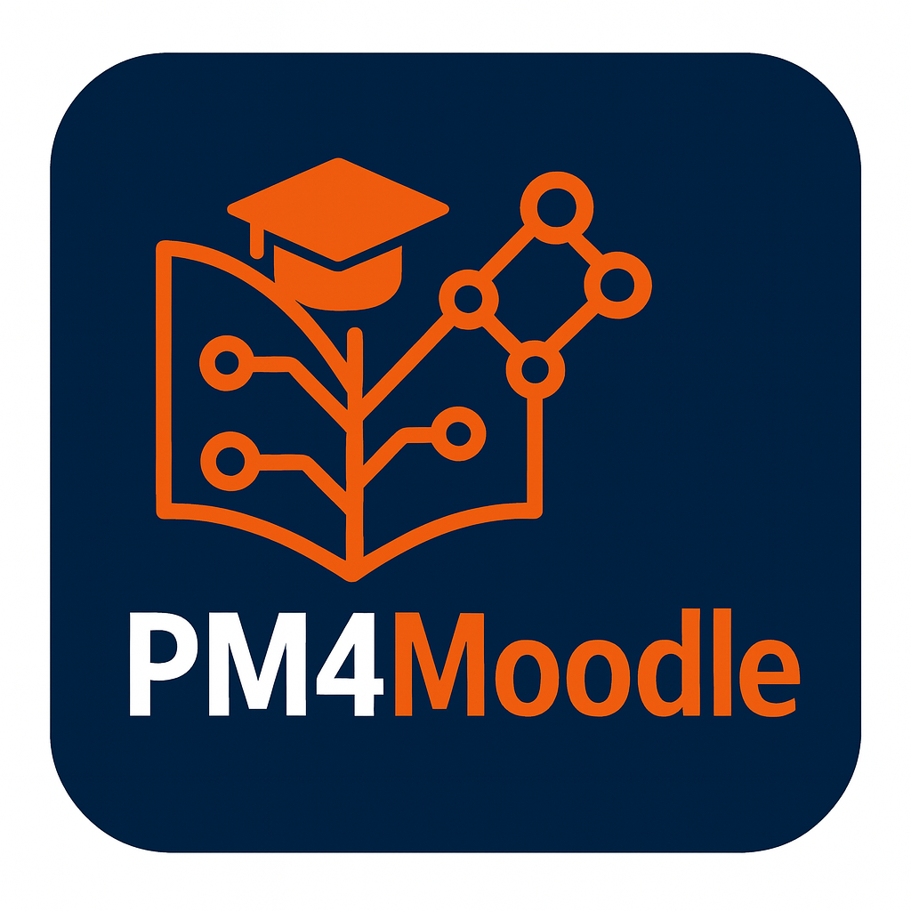
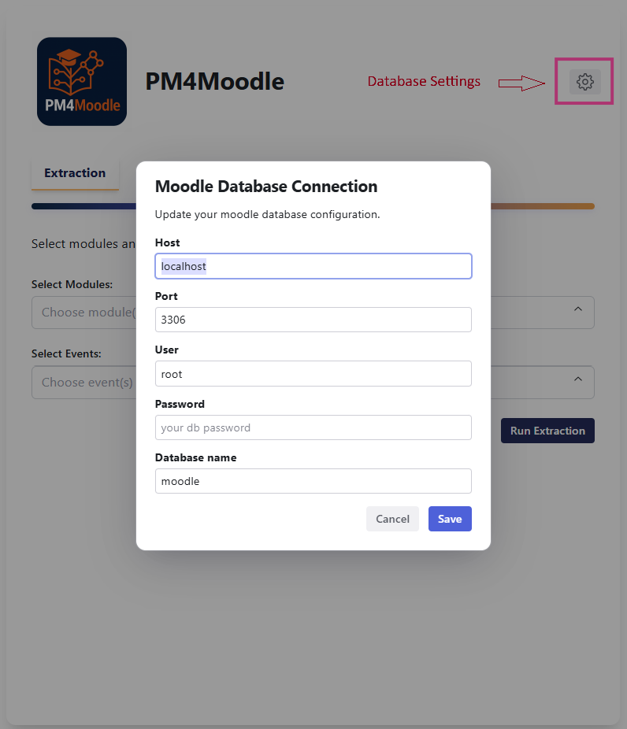
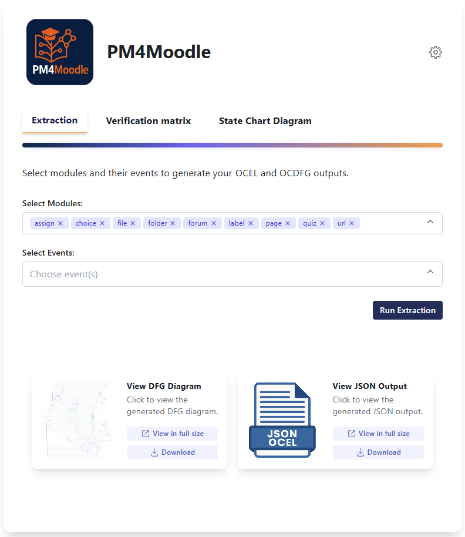
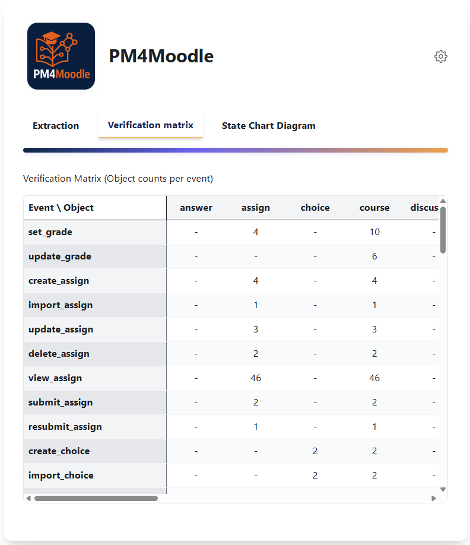
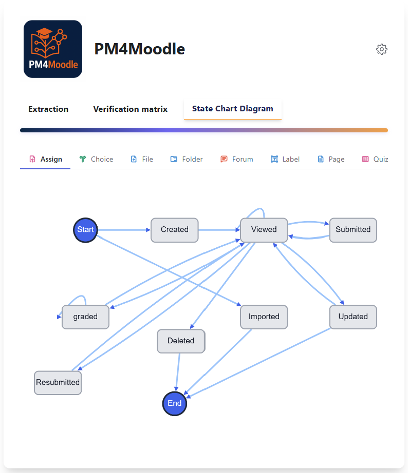

# PM4Moodle



**PM4Moodle** is a specialized, open-source tool for extracting [OCEL 2.0](https://www.ocel-standard.org/) event logs from Moodle, focused on the most common and important Moodle modules. It offers a modern, intuitive interface for users to connect directly to their Moodle database and extract OCEL 2.0 logs effortlessly, enabling advanced process mining and learning analytics.

---

## Key Features

- **Database Connection Interface:** Easily connect to your Moodle database through a user-friendly settings dialog.
- **OCEL 2.0 Extraction:** Seamlessly extract OCEL 2.0 event logs from supported Moodle modules for targeted or comprehensive analysis.
- **Object-Centric Directly-Follows Graph (OC-DFG):** Automatically generate OC-DFG visualizations from the extracted logs to capture behavioral flows.
- **Verification Matrices:** 
  - **Object Frequency Matrix:** Visualize the frequency of each object type per event, supporting quick log quality checks.
  - **Cardinality Matrix:** Display the captured cardinality of objects per event as found in the extracted log, offering deeper insight into object-event relationships.
  - **Flexible Filtering:** Both matrices can be filtered dynamically by columns (event types) and rows (object types), allowing users to focus on specific aspects of the log for verification and analysis.
- **Lifecycle Diagrams:** For each supported module, generate state charts (lifecycle) diagrams based on actual event occurrences, giving a clear view of lifecycle transitions in the extracted data.
- **Downloadable Outputs:** Download both the OCEL 2.0 JSON log and generated OC-DFGs directly from the interface.

This tool streamlines the extraction, validation, and analysis of object-centric event logs from Moodle, facilitating educational analytics using object-centric process mining.

---
## Project Structure

```
root/
├── backend/
│   ├── app.py
│   └── ...
└── frontend/
    └── ...
```

---
## Table of Contents

- [Setup and Installation](SETUP.md)
- [How to Use PM4Moodle](USER_GUIDE.md)
- [Developer Guide](DEVELOPER_GUIDE.md)
- [License](#license)

---


## How to Use PM4Moodle
PM4Moodle’s interface is organized into three main tabs.
Here’s how to extract logs and generate visualizations:

### Set Up Database Connection

- Click the **Settings** button in the top-right corner of the page.
- Enter your Moodle database credentials (host, port, user, password, database name).
- Save your settings.



### Extraction Tab

#### **Step 1: Select Modules and Events**

- You can **extract logs for all supported modules and their events by simply clicking on "Run Extraction"** without selecting any modules or events.
- Alternatively, **choose one or more Moodle module types** (e.g., Assignment, File, Folder, URL) to extract logs only for those modules. If you select modules but no events, all events for the selected modules will be extracted.
- For more fine-grained control, you can **select specific events for any chosen module** to extract only those events.

#### **Step 2: Extract and Download the Log**

- Click the **Run Extraction** button.
- The tool connects to your database and processes the data to extract the OCEL 2.0 log based on your selection.
- When finished, download the OCEL 2.0 log in JSON format and the Directly-Follows Graph (DFG) as an image, if desired. You can also view these files in full size without downloading them.



### Verification Matrix Tab
- After you extract a log, navigate to the **Verification Matrix** tab to see the matrix automatically generated for your extracted OCEL 2.0 log.
- The verification matrix displays the number of objects per event in the extracted log, allowing you to inspect and verify log quality and completeness at a glance.
- This feature helps teachers and analysts confirm that the log includes the expected level of detail and correct object-event relationships.
- Use the matrix to identify potential data issues before proceeding with further analysis or visualization.



### Statechart Diagram Tab

- Upon extracting an OCEL 2.0 log, users can navigate to the **Statechart Diagram** tab to automatically view statechart lifecycle diagrams for each Moodle module included in the extraction.
- These diagrams are dynamically generated based on the events present in the extracted log, visually depicting the actual lifecycle transitions (such as creation, update, view, and deletion) observed for each module instance.
- It is important to note that the completeness of a statechart diagram directly depends on the event coverage within the extracted log. If certain lifecycle events are absent from the data—for instance, if a module instance was never deleted or updated—those transitions will not appear in the statechart, and the full lifecycle cannot be reconstructed.
- This feature enables users to gain an object-centric understanding of process behavior at the module level, and to assess which lifecycle transitions are supported by empirical evidence in the dataset.

As an example, the figure below illustrates the statechart diagram generated for the **Assignment** module:




---
## License

 
[MIT](LICENSE)

---

