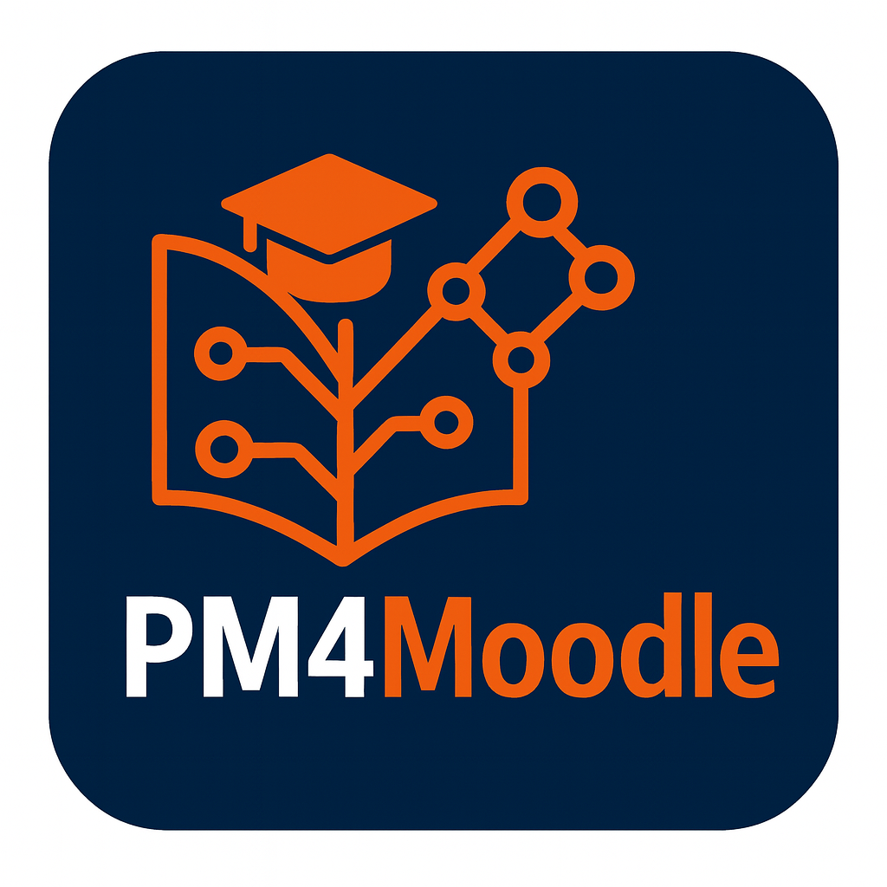

# PM4Moodle



**PM4Moodle** is a specialized, open-source tool for extracting [OCEL 2.0](https://www.ocel-standard.org/) event logs from Moodle, focused on the most common and important Moodle modules. It offers a modern, intuitive interface for users to connect directly to their Moodle database and extract OCEL 2.0 logs effortlessly, enabling advanced process mining and learning analytics.

---

## Key Features

- **Database Connection Interface:** Easily connect to your Moodle database through a user-friendly settings dialog.
- **OCEL 2.0 Extraction:** Seamlessly extract OCEL 2.0 event logs from supported Moodle modules for targeted or comprehensive analysis.
- **Object-Centric Directly-Follows Graph (OC-DFG):** Automatically generate OC-DFG visualizations from the extracted logs to capture behavioral flows.
- **Verification Techniques:** 
  - **Verification Matrix (Frequency):** Visualize the frequency of each object type per event, supporting quick log quality checks.
  - **Verification Matrix (Cardinality):** Display the captured cardinality of objects per event as found in the extracted log, offering deeper insight into object-event relationships.
  - **Flexible Filtering:** Both matrices can be filtered dynamically by columns (event types) and rows (object types), allowing users to focus on specific aspects of the log for verification and analysis.
    - **State Chart Diagrams:** For each supported module, generate state charts (lifecycle) diagrams based on actual event occurrences, giving a clear view of lifecycle transitions in the extracted data.
- **Downloadable Outputs:** Download both the OCEL 2.0 JSON log and generated OC-DFGs directly from the interface.

This tool streamlines the extraction, validation, and analysis of object-centric event logs from Moodle, facilitating educational analytics using object-centric process mining.

---
## Quick Start — try it with Docker (recommended)

**Want to try PM4Moodle without installing anything?** The Docker demo runs the
complete tool against a bundled test dataset. You do **not** need to install
Moodle, MySQL, Python or Node, and there is no database to restore by hand.

Install [Docker Desktop](https://www.docker.com/products/docker-desktop/), then:

```bash
git clone https://github.com/MiriNajme/PM4Moodle.git
cd PM4Moodle
docker compose up --build
```

Open <http://localhost:8080> and click **Run Extraction**.

Optionally, the demo can also start a **live, editable Moodle** alongside it, so
you can change a course and immediately see the change in a freshly extracted
log.

➡️ **Full instructions: [Docker Demo Guide](DOCKER_DEMO.md)**

> Prefer a manual installation, or want to connect PM4Moodle to your *own*
> Moodle? Follow the [Setup Guide](SETUP.md) instead.

---
## Project Structure

```
root/
├── backend/
│   ├── app.py
│   └── ...
└── frontend/
    └── ...
```

---
## Documentation Overview

**Start here**

- [Docker Demo Guide](DOCKER_DEMO.md) — run everything with one command, nothing to install *(recommended for first-time users and reviewers)*

**Manual installation and usage**

- [PM4Moodle Setup Guide](SETUP.md) — install and run the backend and frontend yourself
- [PM4Moodle Usage Guide](USAGE_GUIDE.md) — how to use the interface and interpret the outputs
- [Moodle Setup Guide](MOODLE_SETUP.md) — install Moodle locally *(not needed for the Docker demo)*
- [Testing with Example Dataset](TEST_DATASET.md) — restore the test dataset manually *(not needed for the Docker demo)*

**Background**

- [OCPM<sup>2</sup> Methodology and Case Study](METHODOLOGY_AND_CASE_STUDY.md)
---
## License

 
[MIT](LICENSE)

---

