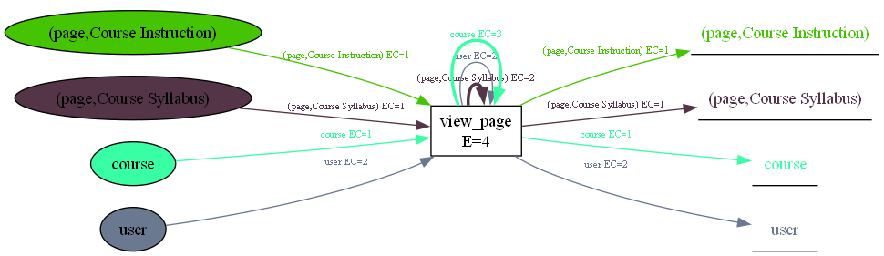
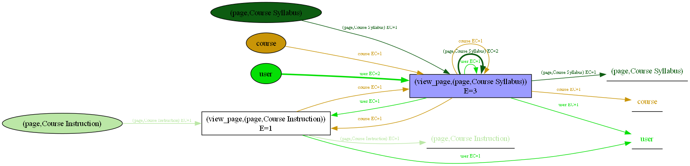

# Testing with Example Dataset

This page explains how to download, set up, and use the provided test dataset by PM4Moodle for OCEL 2.0 extraction.

---
## Table of Contents

- [About the Test Dataset](#about-the-test-dataset)
- [Downloading the Test Dataset](#downloading-the-test-dataset)
- [Setting Up the Test Dataset](#setting-up-the-test-dataset)
- [Testing Extraction with PM4Moodle](#testing-extraction-with-pm4moodle)
- [How the Test Log Enables Analysis for the Questions](#how-the-test-log-enables-analysis-for-the-questions)

---

## About the Test Dataset

The test dataset is a complete backup (`backup.sql`) from a Moodle database, created specifically for testing PM4Moodle.  
It includes data for 9 of the most common and pedagogically important Moodle modules, as identified by instructor interviews.

---

## prerequisites

> **prerequisite 1:**  
> If you have not cloned and set up the project yet, please do the steps described in the [Setup Guide](SETUP.md).  

The test dataset is already included in your cloned project.  
You can find it in the `test_dataset` directory, with the filename: [backup.sql](test_dataset/backup.sql).

> **prerequisite 2:**  
> If you have not set up Moodle, please do so by following the steps described in the [Moodle Setup Guide](MOODLE_SETUP.md).  
---

## Setting Up the Test Dataset

You can use the `moodle_backup_restore.py` script to restore the provided test Moodle database backup into a new database.  
Below are step-by-step instructions for using the tool interactively.

---

### 1. Run the Backup/Restore Script

Open your **PowerShell** on Windows or your default terminal on Mac and navigate to the folder containing the script (PM4Moodle/test_dataset), then run:

> **Note:**  
> Note that if your operating system is Windows, the following commands run only in PowerShell.


```bash
python moodle_backup_restore.py
```
### 2. Respond to the Prompts

- **Default Configuration:**  
  The tool will display default settings (host, username, password, source database, backup path, destination database, etc.).
  - When asked:  
    `Would you like to use the default configuration? [Y/n]:`  
    - Type `n` to enter your own details, or just press `Enter` (or type `y`) to use the defaults.

- **For Each Prompt:**  
  For each of the following, either press `Enter` to accept the default value in brackets, or type your custom value:
  - **Enter host [localhost]:**  
  Database server address. Press `Enter` for local computer or type another address if needed.
- **Enter username [root]:**  
  MySQL username. Press `Enter` for `root` or type your username.
- **Enter password [empty]:**  
  MySQL password. Press `Enter` if none, or type your password.
- **Enter source database [moodle]:**  
  Name of your original Moodle database. *(Not needed for restoring an existing backup—just press `Enter` to continue.)*
- **Destination database:**  
  Enter the name you want for your new test database (e.g., `test_moodle`), or press `Enter` to use the default name.
- **Backup file path:**  
  Enter the full path to where you stored the `backup.sql` file (default is `PM4Moodle/test_dataset/backup.sql` inside your project folder).
- **MySQL binary folder:**  
  Enter the path to the `bin` folder of your MySQL installation (e.g., ` C:\Moodle5.1\server\mysql\bin` or as shown by your Moodle installer).

- **Backup Step:**  
  When prompted:  
  `Would you like to create a backup from 'moodle' database? [y/n]:`  
  - Type `n` (because you already have the backup file provided).

- **Restore Step:**  
  When prompted:  
  `Would you like to restore backup to 'your_database_name' database? [y/n]:`  
  - Type `y` to proceed with restoring your backup file into the specified database.

**The Figure below shows an example of restoring the backup file.** 
<p align='center'>

</p>

## Testing Extraction with PM4Moodle

### 1. Start the PM4Moodle tool  
  For setup details, see the [Setup Guide](SETUP.md).
  
Once the tool is running, as a tester, you will see the main extraction interface (see the figure below). 
<p align='center'>

</p>
Here’s what you should check and how to validate the extraction against the test dataset:

### 2. Connect to the test database you just restored (see the figure below)
<p align='center'>

</p>

> **Note:**  
> The provided backup file (`backup.sql`) is a database-level backup designed specifically for use with PM4Moodle. It does not represent a Moodle course backup that can be directly imported or viewed as a course within the Moodle interface. Instead, it contains test data that you can extract and analyze using PM4Moodle.
> If you’d like to explore Moodle’s features or try extracting your own data, you are welcome to create new test courses in your local Moodle installation as well.

### 3. Run the extraction
  Click “Run Extraction” to generate the OCEL 2.0 event log and DFG visualization.  
  Download links will be provided for the log and its OC-DFG. You see:

<p align='center'>

</p>

### 4. Validate the extraction results 
  Use the Verification Matrix and State Chart Diagram tabs to check if all required relationships and lifecycles are present in the extracted log.  
  (See screenshots and details in the [Usage Guide - Verification Matrix Tab](USAGE_GUIDE.md#verification-matrix-tab).)

---

### 5. Analysis Iteration

To see how the extracted log enables analysis for Q1–Q5 (also presented in our [case study](METHODOLOGY_AND_CASE_STUDY.md#4-analysis-iteration) in a production environment), you should extract and analyze logs **separately for each analytical question**.  
This is because the complete OCEL 2.0 log and OC-DFG can be very large and difficult to interpret; extracting and visualizing the relevant subset for each question produces clearer, more actionable insights.

***For example, suppose you want to answer the following analytical(Q1-Q4) and general(Q5) questions for the course `DTO-HT24 - Digital Transformation in Organization` in the test dataset. In the extraction interface, select this course from the “Select Courses” dropdown, then select the relevant modules and event types for the specific question you are investigating (see below for details).***

- Q1: What learning paths do students typically follow when accessing educational materials, such as files, pages, and folders, throughout a course?
- Q2: How do students submit (or resubmit) individual and group assignments during the course?
- Q3: Do students who usually take the lead in submitting group assignments on behalf of the group tend to achieve higher final grades?
- Q4: How is students' exam success related to their frequency of accessing course materials, such as files, pages, and folders?
- Q5: How can OCEL 2.0 event logs be systematically extracted for Moodle’s most important standard modules?
---

### Q1 & Q4: Learning Paths and Resource Access vs. Exam Success

- **Extraction:**  
  Select only "view" events (for files, pages, and folders) and the relevant course. Here we only test the object type Page as an example.  
  Extract the log and generate the OC-DFG.

 *Example OC-DFG for Q1/Q4 (filtered by "view" events):*  
  
 
  For more detailed analysis, one can write scripts to drill down objects into individual objects (pages, files, folders, users) if needed, depending on the question, and unfold "view" event types as needed.

*Example OC-DFG for Q1/Q4 (after log adjustments by drilling down the object page and unfolding view events):* 

     

---

### Q2 & Q3: Assignment Submission Behaviors and Leadership Effects

- **Extraction:**  
  Select the "Assign" module and the "submit_assign" and "resubmit_assign" events, then extract the log.
  
  Then, detailed analysis is enabled by further drilling down on user types (teacher and student) and assignment objects into their specific names, and unfolding event types.  
  This will help analyze both submission behavior (Q2) and identify lead submitters (by counting how many times each student submitted a group assignment on behalf of the group) and their grades for group work analysis (Q3).

  The resulting OC-DFG shows the relationships between users, assignments, groups, and courses for each submission or resubmission.

  *OC-DFG for assignment submissions (Q2/Q3):*  
  

---

### Q5: Systematic Extraction for All Modules

- **Extraction:**  
  Leave all fields unselected to extract logs for all prioritized Moodle modules and events.

- **Purpose:**  
  This demonstrates that the tool supports systematic OCEL 2.0 extraction across all core modules, facilitating comprehensive analysis.
 
For detailed step-by-step filtering and analysis, see the [Usage Guide](USAGE_GUIDE.md).

---
