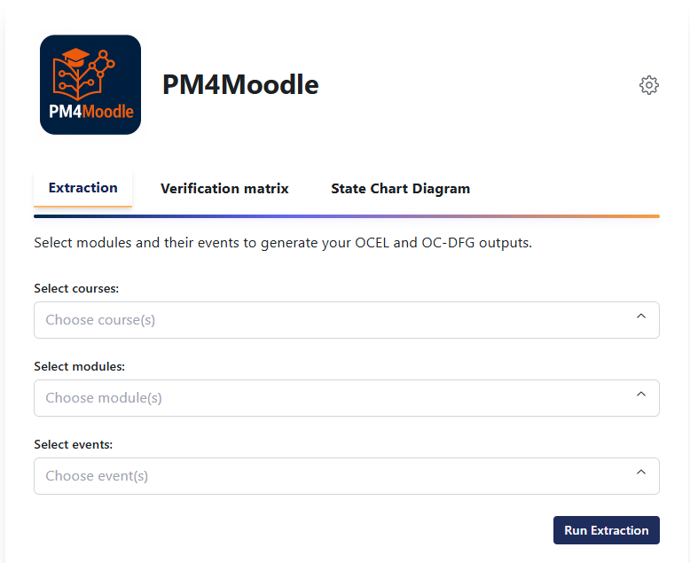
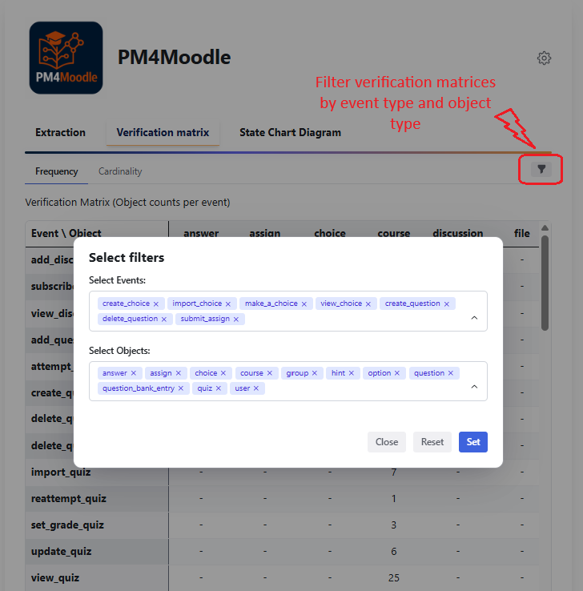

# PM4Moodle Usage Guide

Welcome to the **PM4Moodle User Guide**!  
This document provides a comprehensive overview of the tool’s main features and a step-by-step guide for end-users.

---

## Table of Contents

- [Interface Overview](#interface-overview)
- [Set Up Database Connection](#set-up-database-connection)
- [Extraction Tab](#extraction-tab)
- [Verification Matrix Tab](#verification-matrix-tab)
- [State Chart Diagram Tab](#state-chart-diagram-tab)

---
## Interface Overview

PM4Moodle features an intuitive and modern web interface, consisting of three main tabs: **Extraction**, **Verification Matrix**, and **Statechart Diagram**. The navigation bar allows users to seamlessly switch between the core functionalities of the tool.  
The **Extraction** tab is the starting point for log generation, while the **Verification Matrix** and **Statechart Diagram** tabs support in-depth analysis and quality assurance of the extracted event data.

---
## Set Up Database Connection

- Click the **Settings** button in the top-right corner of the page.
- Enter your Moodle database credentials (host, port, user, password, database name).
- Save your settings.

---

## Extraction Tab

### **Step 1: Select Courses, Modules, and Events**

- Begin by selecting the **course or courses** from which you wish to extract event logs. If you do not select any courses, logs will be extracted from all available courses by default.
- After choosing courses, you may **select one or more Moodle module types** (such as Assignment, File, Folder, URL) to target your extraction to specific modules. If you select modules but no events, all events for the selected modules within the chosen courses will be extracted.
- For even more granular control, you can **select specific events for any chosen module** to extract only those events within the selected courses and modules.
- For comprehensive extraction, you may simply click **"Run Extraction"** without selecting any courses, modules, or events; in this case, logs for all supported modules and events across all courses will be extracted.

### **Step 2: Extract and Download the Log**

- Click the **Run Extraction** button.
- The tool connects to your database and processes the data to extract the OCEL 2.0 log based on your selection.
- When finished, download the OCEL 2.0 log in JSON format and the Directly-Follows Graph (DFG) as an image, if desired. You can also view these files in full size without downloading them.

---

## Verification Matrix Tab

The Verification Matrix tab provides log quality checks by automatically generating two types of matrices from the extracted OCEL 2.0 log. This tab enables users (especially teachers and analysts) to verify whether all expected object-event relationships are captured, and to identify any gaps or unexpected patterns:

- **Filtering:** Both matrix types are interactive and can be filtered by object type (row) or event type (column), enabling focused analysis.

- **Object Frequency Matrix:** Displays the frequency of each object type per event type, supporting quick inspection of the relationships in the log.

- **Cardinality Matrix:** Shows the minimum and maximum cardinality of objects per event as observed in the extracted log, facilitating detection of anomalies and validation against expected extraction matrices.

---

## State Chart Diagram Tab

After extracting the OCEL 2.0 log, users can access the Statechart Diagram tab, where PM4Moodle automatically generates statechart diagrams for each extracted module.

- **Lifecycle Visualization:** The diagrams illustrate the actual state transitions (such as create, update, view, and delete) observed in the data for each module instance.
- **Interpretation:** Users can compare the system’s observed behavior with expected module lifecycles and gain insights into module usage patterns.

