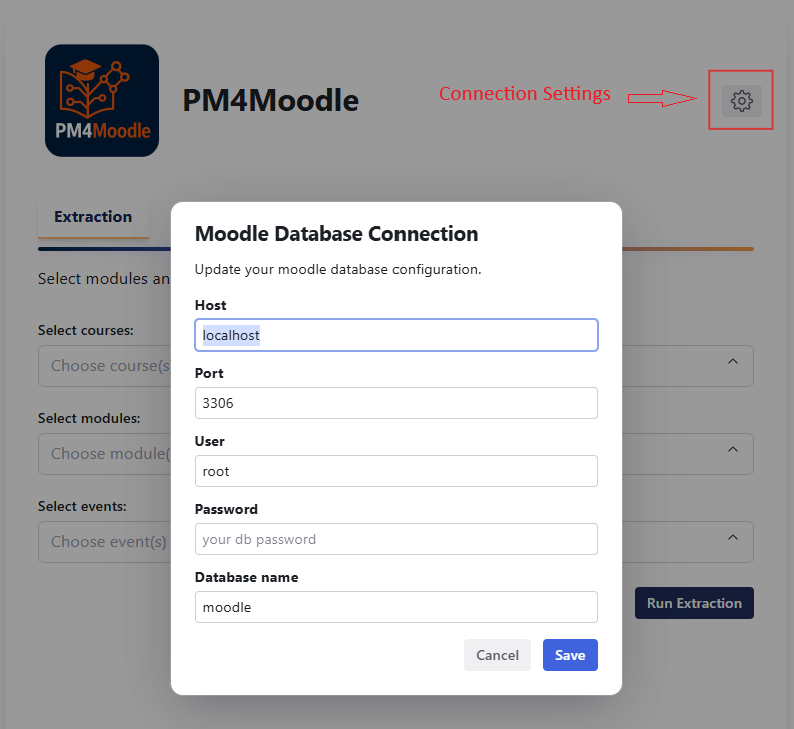

# PM4Moodle User Guide

Welcome to the **PM4Moodle User Guide**!  
This document provides a comprehensive overview of the tool’s main features and a step-by-step guide for end-users.

---

## Table of Contents

- [Interface Overview](#interface-overview)
- [Set Up Database Connection](#database-connection)
- [Extraction Tab](#extraction-tab)
- [Verification Matrix Tab](#verification-matrix-tab)
- [Statechart Diagram Tab](#statechart-diagram-tab)
- [Download and Export](#download-and-export)
- [Tips and Best Practices](#tips-and-best-practices)
- [FAQ](#faq)
- [Getting Help](#getting-help)

---
## Interface Overview

PM4Moodle features an intuitive and modern web interface, consisting of three main tabs: **Extraction**, **Verification Matrix**, and **Statechart Diagram**. The navigation bar allows users to seamlessly switch between the core functionalities of the tool.  
The **Extraction** tab is the starting point for log generation, while the **Verification Matrix** and **Statechart Diagram** tabs support in-depth analysis and quality assurance of the extracted event data.

---
## Set Up Database Connection

- Click the **Settings** button in the top-right corner of the page.
- Enter your Moodle database credentials (host, port, user, password, database name).
- Save your settings.

---

## Extraction Tab

### **Step 1: Select Modules and Events**

- You can **extract logs for all supported modules and their events by simply clicking on "Run Extraction"** without selecting any modules or events.
- Alternatively, **choose one or more Moodle module types** (e.g., Assignment, File, Folder, URL) to extract logs only for those modules. If you select modules but no events, all events for the selected modules will be extracted.
- For more fine-grained control, you can **select specific events for any chosen module** to extract only those events.

### **Step 2: Extract and Download the Log**

- Click the **Run Extraction** button.
- The tool connects to your database and processes the data to extract the OCEL 2.0 log based on your selection.
- When finished, download the OCEL 2.0 log in JSON format and the Directly-Follows Graph (DFG) as an image, if desired. You can also view these files in full size without downloading them.

